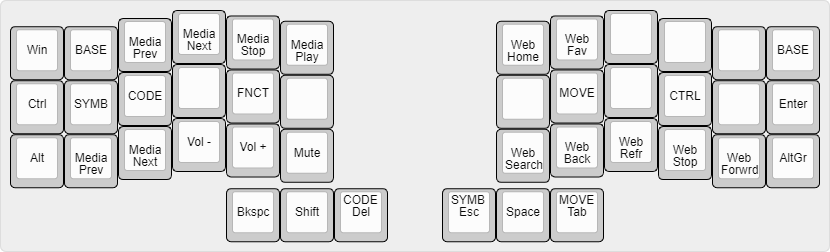

# ATNRB

A layout for the Corne keyboard.

## The layers

### Base

### Symbols

### Code

### Function

### Move

 

### Control

## Stuff

Images generated using [ww.keyboard-layout-editor.com](http://www.keyboard-layout-editor.com).
